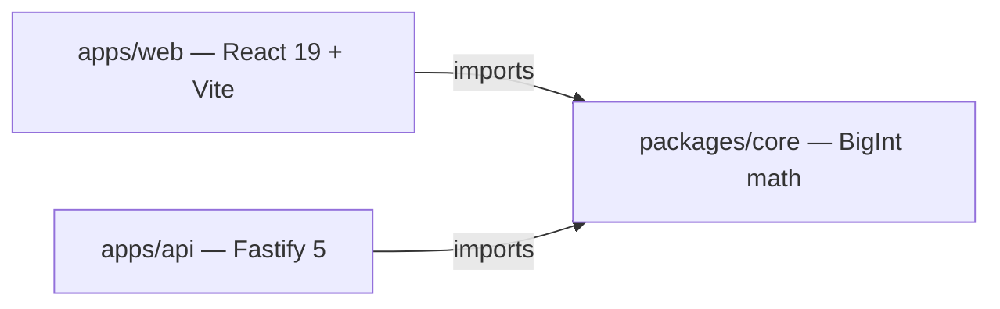
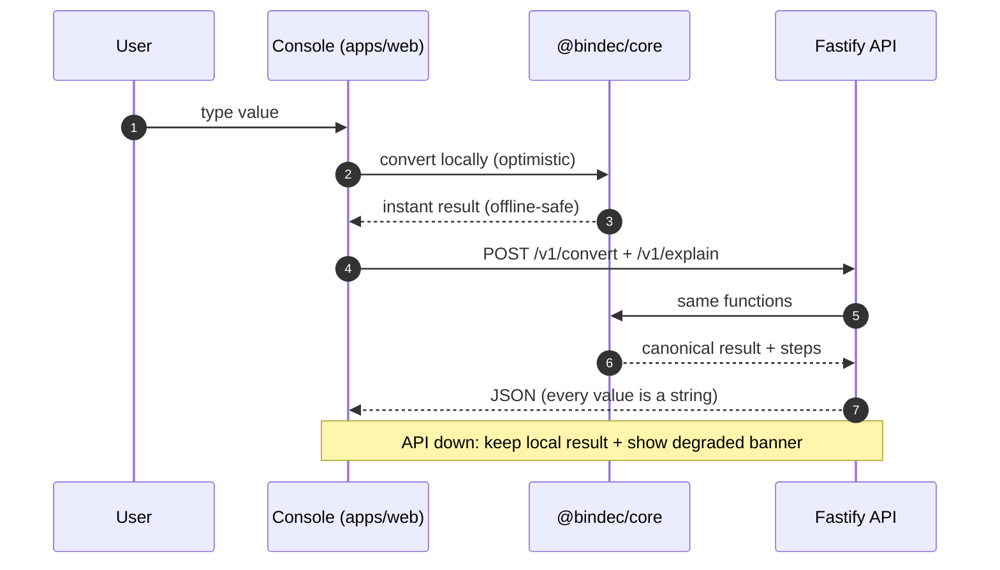
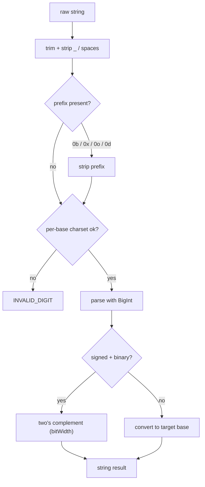
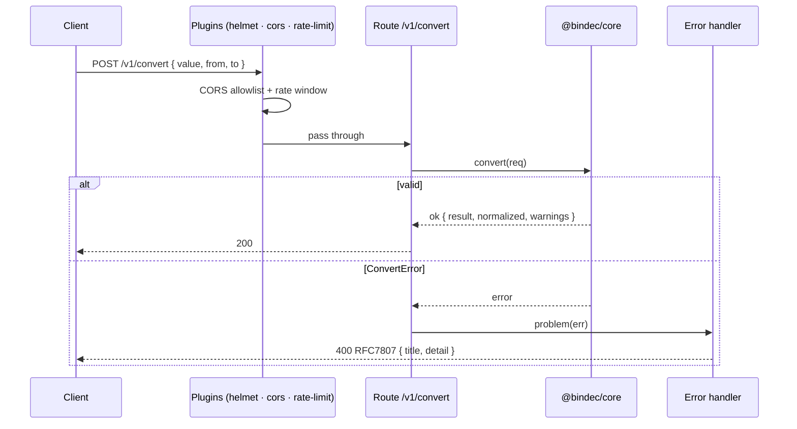
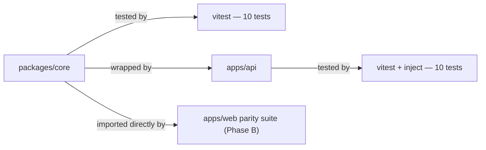

# Bindec — Project Documentation

> **Binary ↔ decimal console**, with hex/octal on the same engine. A dark "instrument panel" UI,
> a Fastify API, and one shared math package so web, API, and a future native shell never diverge.

---

## 1. Architecture

npm-workspace monorepo. **Dependency rule:** `apps/web` and `apps/api` both import `@bindec/core`; the
core is the only place conversion/validation logic lives.

```
bindec/
├── apps/
│   ├── web/                     # React 19 + Vite 7 + Tailwind 4 + Framer Motion
│   │   ├── public/              # PWA manifest + icon.svg
│   │   ├── src/
│   │   │   ├── components/ui.tsx# glass primitives (GlassCard, BasePill, Key, SectionLabel)
│   │   │   ├── lib/             # api client (local+remote), history (localStorage)
│   │   │   ├── App.tsx          # shell state container (being split in Phase B)
│   │   │   └── index.css        # tokens, glass, aurora/grid, reduced-motion
│   │   └── capacitor.config.json# appId dev.bindec.app, webDir dist
│   └── api/                     # Fastify 5 + TypeScript
│       ├── src/app.ts           # plugins + routes + error handling (RFC7807)
│       ├── src/server.ts        # boot on PORT (default 8787, host 0.0.0.0)
│       └── tests/               # vitest + fastify.inject (10 tests)
├── packages/
│   └── core/                    # @bindec/core — BigInt convert/validate/explain
│       ├── src/{convert,errors,types,index}.ts
│       └── tests/               # vitest (10 tests)
├── package.json                 # root scripts: dev, test, build
├── PLAN.md                      # work roadmap (this repo's status)
└── README.md                    # quick start + API summary
```

Dependency rule in one picture:



### Data flow



---

## 2. Shared core — `@bindec/core`

All numeric payloads are **strings**; encoding/decoding uses `BigInt` **only** (no `parseInt`/`Number`
on the integer path). JSON cannot carry BigInt safely, so the API never returns JS numbers.

| Export | Purpose |
|---|---|
| `convert(req)` | Canonical conversion; result is a string |
| `validate(req)` | Normalize + field errors without converting |
| `explain(req)` | Ordered steps (powers of 2 / successive division) |
| `normalizeDigits(value, from)` | Trim, strip `_`/spaces, strip `0b/0x/0o/0d`, canonicalize |
| `META` | `{ bases, bitWidths, maxDigits: 1024 }` |
| `ConvertError`, `ErrorCode`, `problem()` | Structured errors (RFC7807) |
| `BASES`, `BIT_WIDTHS`, `Base`, `BitWidth`, types | Type-level contracts |

`ConvertRequest = { value: string; from: Base; to: Base; signed?: boolean; bitWidth?: 8|16|32|64 }`

### Conversion rules (the bug list the core closes)
- **Arbitrary size** — BigInt end-to-end; 1024-digit cap via `META.maxDigits`.
- **Whitespace** — trimmed; grouping `_`/spaces ignored (`1010_1100` OK).
- **Prefixes** — `0b` / `0x` / `0o` / `0d` accepted and stripped; mixed junk rejected.
- **Empty / prefix-only** — explicit `EMPTY`.
- **Invalid digits** — per-base charset regex, no silent dropping.
- **Leading zeros** — stripped with a `leading_zeros_stripped` warning.
- **Signed binary** — two's complement only with `signed` + `bitWidth`; overflow → `OVERFLOW_WIDTH`.
- **Width** — pad with `0`/sign bit; never silently truncate.
- **Same base** — `from === to` → `SAME_BASE` (Phase A addition).
- **Fractions** — `.` → `UNSUPPORTED_FRACTION` (phase-2 feature).
- **XSS/clipboard** — output is plain text, never `innerHTML`.

Pipeline behind every request:



### Error taxonomy
`EMPTY` · `INVALID_DIGIT` · `OVERFLOW_WIDTH` · `UNSUPPORTED_FRACTION` · `SAME_BASE`
→ serialized as `{ type: "urn:bindec:error:<CODE>", title, status, detail }`.

---

## 3. API — Fastify (`apps/api`)

Plugins: **Helmet** · **CORS allowlist** (`CORS_ORIGIN` env, comma-separated; default
`http://localhost:5173`) · **rate limit** (120/min default; blocked origins get **no** CORS header) ·
**body cap** 32 KB. Error handler maps `ConvertError` → RFC7807 body.

| Method | Path | Role |
|---|---|---|
| GET | `/v1/health` | Liveness |
| GET | `/v1/meta` | Max digits, allowed bases, signed widths |
| POST | `/v1/validate` | Normalize + field errors without converting |
| POST | `/v1/convert` | Canonical convert |
| POST | `/v1/explain` | Ordered steps |
| GET | `/v1/convert?from&to&v` | Same as POST, for shareable URLs |

`buildApp(opts?)` — injectable `{ corsOrigin, rateMax }` for tests → currently **10/10 passing**.

Request lifecycle:



---

## 4. Web app — `apps/web`

- **Stack:** React 19, Vite 7, Tailwind CSS 4 (via `@tailwindcss/vite`), Framer Motion, TypeScript strict.
- **Shell:** full-viewport aurora/grid backdrop, glass cards, safe-area padding, `viewport-fit=cover`.
- **Fonts:** Instrument Serif (display italic titles) + IBM Plex Mono (values/bits).
- **Console:** from/to base pickers (auto-swap on conflict), swap, live result with AnimatePresence
  reveals, copy button, binary 0/1 keypad, signed/unsigned toggle.
- **Bit rail:** 8/16/32/64 toggles; clicking a cell flips that bit and re-converts instantly.
- **Explain:** staggered step cards — `1×2^3 + 0×2^2 + …` from `POST /v1/explain` (local fallback).
- **History:** last 8 conversions in `localStorage` (`bindec.history`), click to restore.
- **Share/copy:** URL stays in sync via `?from&to&v`; result copy via Clipboard API.
- **Degraded mode:** on API failure, local result is kept and a banner is shown.
- **PWA:** `manifest.webmanifest` + `icon.svg`.
- **Capacitor:** `capacitor.config.json` → `npx cap add android` later.

### Design language
Dark instrument panel. CSS tokens in `index.css` (`--bg #07080d`, `--ink #eef2f6`,
`--muted #8b93a7`, `--accent #7ee0c6`). Glass = `backdrop-filter: blur(22px) saturate(160%)`,
1px top-lit border, inset highlight. `prefers-reduced-motion` collapses animations to ~0.

---

## 5. Testing

```
npm test          # root → core tests → api tests (web parity suite lands in Phase B)
npm run build     # root → vite production build of apps/web
```

| Suite | Count | Covers |
|---|---|---|
| `packages/core` | 10 | BigInt/prefixes/grouping, signed 2's-complement, overflow, empty/invalid, same-base, validate, explain |
| `apps/api` | 10 | health, meta, validate, convert, SAME_BASE, explain, GET convert, CORS allow/block, rate limit 429 |

Client/server parity is enforced because **the same `@bindec/core` functions** run in the browser
(optimistic) and the API (canonical); Phase B adds a web-workspace vitest suite that re-runs core cases.



---

## 6. Quick start

```bash
npm install
npm test
npm run dev        # concurrently: API :8787 + Web :5173
```

- Web: http://localhost:5173  (fallback if bound IPv6-only: http://[::1]:5173)
- API: http://127.0.0.1:8787/v1/health
- API env: `PORT=8787`, `CORS_ORIGIN=http://localhost:5173`

### Native shell (later)
```bash
cd apps/web
npx cap init
npx cap add android
```
`webDir` is already `dist`; production UI is the same web build wrapped by Capacitor.